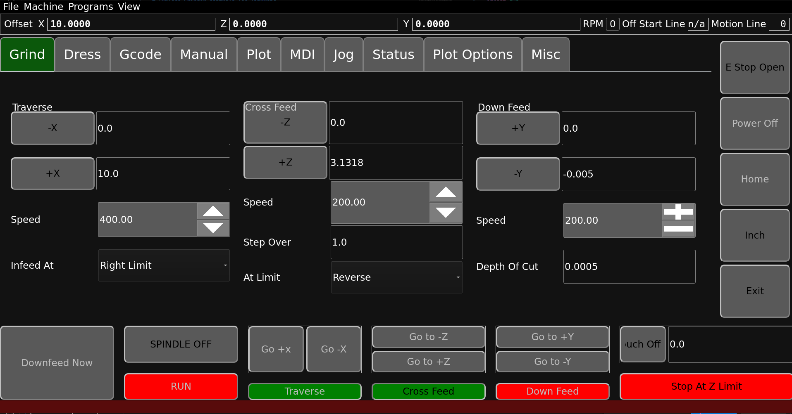

# Surface Grinder controls for linuxcnc

Semi-automatic surface grinder interface similar to hydraulic grinders, but with extra functionality



## Quick install

install linuxcnc 2.9 using the debian 12

<http://www.linuxcnc.org/>

install flexgui: <https://github.com/jethornton/flexgui>

### Dependencies

```
sudo apt install python3-pyqt6 libqt6core6
```

## Configuration

Everything you need to get started is in the config directory. It may be as simple as copying everything to your linuxcnc directory in your home dir.

grinder-sim.ini is a sample configuration using simulated hardware. Of particular note is the following lines:

```
[DISPLAY]
DISPLAY = flexgui
GUI = grinder_touch.ui
QSS = touch.qss

[FLEX]
IMPORT = grinder

[RS274NGC]
SUBROUTINE_PATH=subroutines
USER_M_PATH=m_codes

[HAL]
HALFILE = grinder.hal
```

grinder.hal launches the c++ backend that handles the motion coordination and end stop configurations. The rest is flexgui configuration required to load the python frontend.

The UI is designed to be run full screen on a 1920x1200 touch screen monitor. If you require a different resolution, try changing `parent.setFixedSize(1920, 1200)` to what you need. There are a lot of fixed placement gui elements, so much different than that will probably look weird. If you want to use the qt6 designer to fix that, we accept pull requests!

## Running

Theoretically, all that is required is grinder.hal to run the backend, it would be entirely possible to operate the backend without any particular frontend just by setting hal pins. It's much easier with a ui though!

### Simulated hardware

Give it a try:

```
cd grinder_touch/config
./startsim.sh
```

## Resources

* [Development](https://github.com/digiexchris/grinder_touch)
* [Flexgui](https://github.com/jethornton/flexgui)

## Dependancies

* [LinuxCNC](https://linuxcnc.org) 2.9.1 or later
* Python 3.9 or later
* PyQt6

grinder_touch is developed and tested using the LinuxCNC Debian 12, It should run on any system that can have PyQt6 installed, but Debian 12 is the only OS
that is officially supported.

## In Progress

* Automated wheel dressing and dressing helpers
* Swapping from inch to metric units and converting the limits/feeds/speeds accordingly
* Spindle stop/start button

## Future Ideas

* Arbitrary axis for each operation type (eg. Side wheel grinding a vertical face, so infeed would be up/down not in/out and downfeed would be in/out. Or even crazier, swap the big left/right motion of a normal surface grinder with the up/down axis, so you can face the side of something by sweeping up and down and crossfeeding left and right. )
* Radius or other wheel dressing forms
* Cutter grinding cycles
* Cam grinding modes (4rth axis)

## DISCLAIMER

THE AUTHORS OF THIS SOFTWARE ACCEPT ABSOLUTELY NO LIABILITY FOR
ANY HARM OR LOSS RESULTING FROM ITS USE.  IT IS _EXTREMELY_ UNWISE
TO RELY ON SOFTWARE ALONE FOR SAFETY.  Any machinery capable of
harming persons must have provisions for completely removing power
from all motors, etc, before persons enter any danger area.  All
machinery must be designed to comply with local and national safety
codes, and the authors of this software can not, and do not, take
any responsibility for such compliance.

## LICENSE

MIT License

Copyright (c) 2024 Christopher Chatelain

Permission is hereby granted, free of charge, to any person obtaining a copy
of this software and associated documentation files (the "Software"), to deal
in the Software without restriction, including without limitation the rights
to use, copy, modify, merge, publish, distribute, sublicense, and/or sell
copies of the Software, and to permit persons to whom the Software is
furnished to do so, subject to the following conditions:

The above copyright notice and this permission notice shall be included in all
copies or substantial portions of the Software.

THE SOFTWARE IS PROVIDED "AS IS", WITHOUT WARRANTY OF ANY KIND, EXPRESS OR
IMPLIED, INCLUDING BUT NOT LIMITED TO THE WARRANTIES OF MERCHANTABILITY,
FITNESS FOR A PARTICULAR PURPOSE AND NONINFRINGEMENT. IN NO EVENT SHALL THE
AUTHORS OR COPYRIGHT HOLDERS BE LIABLE FOR ANY CLAIM, DAMAGES OR OTHER
LIABILITY, WHETHER IN AN ACTION OF CONTRACT, TORT OR OTHERWISE, ARISING FROM,
OUT OF OR IN CONNECTION WITH THE SOFTWARE OR THE USE OR OTHER DEALINGS IN THE
SOFTWARE.
